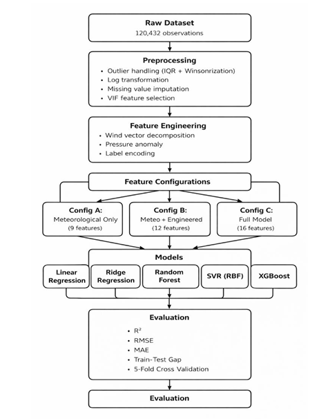

# PM2.5 Air Quality Prediction Using Machine Learning

This project predicts PM2.5 air pollution concentrations using global meteorological and environmental data.

The project follows the CRISP-DM framework and compares five machine learning models:

- Linear Regression
- Ridge Regression
- Random Forest
- Support Vector Regression (SVR)
- XGBoost

The study investigates the contribution of meteorological variables, engineered features, and pollutant co-features to PM2.5 prediction accuracy.

## Dataset

Global Weather Repository Dataset

- 120,432 observations
- 41 features
- Global weather station data

## Methodology

### Data Preprocessing

- Sensor error correction
- Missing value imputation
- Outlier treatment using Winsorization
- Log transformation of PM2.5
- VIF-based multicollinearity removal

### Feature Engineering

- Wind vector decomposition
- Pressure anomaly feature
- Heat stress index
- Weather condition encoding

## Models Evaluated

1. Linear Regression
2. Ridge Regression
3. Random Forest
4. Support Vector Regression (RBF)
5. XGBoost

## Results

| Model | Test R² |
|---------|---------|
| Linear Regression | 0.4183 |
| Ridge Regression | 0.4183 |
| Random Forest | 0.6566 |
| SVR | 0.6993 |
| XGBoost | 0.7749 |

## Key Findings

- XGBoost achieved the best predictive performance with R² = 0.7749.
- Meteorological variables alone explained approximately 40% of PM2.5 variance.
- Pollutant co-features significantly improved model performance.
- Feature engineering and preprocessing substantially improved prediction accuracy.
- SHAP analysis identified Carbon Monoxide as the most influential predictor.

## Pipeline

